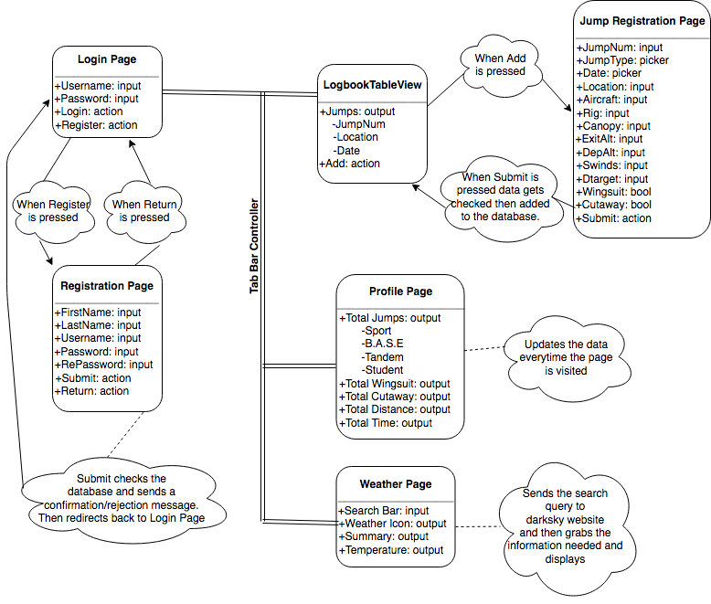

# SkydiveBook – Capstone Project
A prototype of an iOS app to log skydives. A simpler approach to the current pen and paper technique.

*Created for CS 4800 – Capstone Spring 2018

*Author:* Guillaume Gutkin Nicolas

---

# Abstract 

The objective of this application was to create an environment that allows skydivers to log their jump information. The main idea was to transition from the current pen and paper approach to a more modern digital system. This application was designed using Xcode, an integrated development environment by Apple Inc. that specialized in the development of macOS, iOS, tvOS, and watchOS software. 
   
To create an easy to use product, I limited the interface to three tabs: Logbook, Profile, and Weather. This being my first mobile development project I was quite pleased with the result. I was unable to add an editable profile picture and viewable logbook cells in the time I was allotted. However, I was able to integrate the three tabs mentioned above, as well as a login and registration page that will let me keep track of all users data for future work. A future feature I plan to add is a leaderboard score and challenges for the users to compete against one another. 

<b>Keywords:</b> iOS, Xcode, mySQL, PHP, Apple Development, Skydiving, Logbook, User Registration, Weather, Darksky, Views, Bcrypt, JSON. 

---

# Table of contents

1. [Abstract](#abstract)
2. [Introduction and Project Overview](#intropo)
    1. [Problem, Objectives, Users](#pou)
    2. [Background Information](#backinfo)
    3. [Features](#features)
3. [Design, Development, and Test](#ddt)
    1. [Design](#design)
    2. [Development](#development)
    3. [Test](#test)
4. [Results](#results)
5. [Conclusion and Future Work](#cfw)
6. [References](#references)

---

# Introduction and Project Overview 

## Problem, Objectives, Users 

The problem I addressed for this application is the need to transition the current Skydive Logbook from analog to digital. The current book is limited with amount of pages available, and it is small and easily misplaced. A digital version will allow for an unlimited amount of jumps registered, as well as instant summary updates.

The objective was to integrate the current logbook’s field in a digital form, and display the information’s summary on a profile page. The idea behind the design was to create the simplest interface so that people of all ages could use it. This was an important consideration because the sport ranges from 18 to 70 year olds.  
  	
The users I was targeting as mentioned above is any of the current skydivers between the age of 18 and 70 that have an Apple device. The preferable device is the iPhone X as the proportions were designed with that screen in mind. An Apple device is required because this application currently only exists for the iOS platform.

## Background Information 

I chose this application because I have been working on obtaining my A-License, the first of four licenses, and officially joining the skydiving community. The Capstone class was a perfect opportunity to design something that I will actually use in my life, and introduce to a community I want to be a part of.

Before beginning the development I went through the Apple Store looking for any similar existing work, and found two other applications that aimed to accomplish the same thing. I downloaded and played around with them for a bit to see if the project was worth building. What was the point if existing applications already did what I wanted? After using them I found that they had way too many extraneous features such as calculators, import/export settings, links to dropbox, and directories that made you log your gear and aircrafts before being able to use them in the actual Logbook. I decided I didn’t want my application to have all the calculations done in the backend, and to keep the form as close to the traditional one as possible. 
	
I took two classes at Appalachian State University that helped me with the development of this application. The first being CS 3430 - Database, a course that covers the design, organization, representation, and manipulation of databases. The class helped me develop skills in mySQL and PHP that were instrumental to this application. My database runs using mySQL code that can be found in a file within this repository, and PHP was the language I used to communicate between the application and the server. The second class was CS 3440 - Client Side Web Programming, a course that covers browser scripting languages, server communication, event handling, and using JSON. I initially started this application as a web platform, before transferring over to iOS, using many of the previous workouts I had completed for that class. Already being familiar with JSON, event handling, and server communication saved me a ton of time during the learning curve. Every call returned from the server or the API is formatted in JSON making the data easily accessible for the front end.

## Features 

This application has four main features. The first being a user login and registration page, which prevents any unregistered individuals from entering. It also makes sure that each user has a unique username so that there is no unwanted data conflicts. My main reason for implementing this feature is to include a leaderboard in future work, to have competitions between all users.

The second feature is the logbook that displays the users previously logged jumps by jump number, location, and date. It also allows users to add more jumps using the adder in the top right of the screen. When pressed the user is redirected to a form that looks very similar to the current logbook, so that it is an easy transition. Unfortunately the logbook cells don’t redirect to a view with all that jump’s information with a delete option yet, that part is still under construction.

The third feature is the profile summary, a simple view that displays the users name, jump total, time spent in free fall, etc. This feature requires no input from the user, it pulls all its data from the logbook feature and runs the calculations in the background. A missing part of this feature is an editable profile picture allowing the users to add a personal touch. 

The last feature is a weather report of any desired location. The user enters a location in the search bar, then the tab displays the weather for that day and the following. All the data pulled for the weather is from Darksky’s API, a weather website that has a library for developers to use. 

---

# Design, Development, and Test 

## Design 

The idea behind the design was to keep it as simple as possible so that anyone ranging from 18 to 70 would have an easy time transitioning to it. To achieve this I used a tab controller with icons to alternate between the three pages. I also implemented security measures to make sure the user doesn't input the wrong thing. When registering a new user I added the "Re-type Password" field to make sure that the user has the password they intended. The passwords are all hashed using Bcrypt encryption before they are stored on the database, preventing even the developer from knowing the password making it more secure. 

The weather page uses an outside API to help get the data it displays. When a user enters a query in the search bar, that query is then sent to the Darksky API, and if valid will return a large amount of information. A method in the weather page process that information and selects only the data required, which it then displays. 

The design of this application is illustrated bellow:

## Development 

For this project my development approach was to create a basic web application at first and then transition it to iOS. I started with web application because it was something that I was comfortable with after taking CS 3440. I designed all the pages without worrying about the aesthetic, and focusing the communication between front and back end. For the backend I visited two options for the database, MAMP and Google’s Firebase. After interacting with both I chose MAMP because of it’s familiarity. We used the same PHPAdmin interface in CS 3430. Once I got the database and PHP files working with the web pages I switched over to iOS one page at a time. It ended up working, but I spent a good amount of time trying to figure out the Swift syntax during the conversion. The segues between pages also interacted much differently then the web application segues, causing a lot of pesky bugs at first. 

A risk area that I was addressing by developing a web application on the side, was my lack of experience with mobile development. The web application was my safety net incase the mobile application proved to be to challenging. 

## Test 

My testing approach for this application was mostly manual. While I was developing a page I would only work with one input field and comment out the rest. My thinking was that since all fields on a page will be sent and handled the same, once I get one to work the rest will follow the format and should work. When the fields were communicating with the back end properly, but printing out odd results I used the “curl” terminal command to do my testing. It saved me time to test through the terminal rather then re-entering data through the simulator every time. 
Lastly I also used print statements throughout the development process to see what the data looked like at certain stages. This was very useful in identifying which part of the code was failing.

An example call that can be used for testing with curl:

        curl http://localhost:8888/registration/profilePage.php -d “username=a"

---

# Results 

By the end of the Capstone class the core features implemented include: a login/registration page, a logbook, a profile summary, and a weather page. Below is a table that indicates the features I planned at the start of the project:

|Feature|Implemented|Not Implemented|
|---|---|---|
|Profile Picture| | X |
|Visited Drop Zones| | X |
|Skydiving News| | X |
|SCUBA Version| | X |
|User Login and Registration| X | |
|Logbook Page| X | |
|Jump Registration| X | |
|Profile Page| X | |
|Weather Page| X | |

The “Profile Picture” is a feature that I haven’t implemented yet. To implement this I will create a new table that has two columns: a username, and a picture. When users want to change the picture it will delete that users entry in the table and enter in a new one after with the new picture. This feature wasn’t implemented simply because I ran out of time. The hardest obstacle I might encounter is formatting the image to fit to a specific frame. 

The “Visited Drop Zones” and “Link to Skydivers Instruction Manual” are two features I decided to remove early on in the development process too make the application easier to use. I was afraid that too many extra features such as those would overwhelm the users like the other two existing applications did for me. Also I figure that they would have pictures or mementos to remember the drop zones they had visited. 

The “Skydiving News” would have been a neat feature to add however I did not find any existing libraries that would allow me to pull that kind of information. To incorporate this feature I would have to create a web scrapper that visits the Red Bull Air Force and USPA websites daily, assess if the information is useful, and then format and send it to my application. It doesn’t seem impossible, but it is a bigger project that I didn’t have time for in our sixteen week timeline. 

The “SCUBA version” was a feature that allowed users to choose between Skydiving and SCUBA at the login page, and the application would redirect to the appropriate platform. The idea initially started because both sports require a logbook that tracks and analyzes the information. It was a cool idea at the beginning, but as the development progressed I realized that it is a different project all together since both sports don’t necessarily intertwine. 

Screenshots of the implemented results can be found in the  file. 

---

# Conclusion and Future Work 

A lesson that I learned creating this application is to manage my time more efficiently. During the development process I spent a lot of time focusing on the user registration and weather feature, which were bonus features complimenting my original idea. I should’ve started with the Logbook feature since it’s the core of the application, and made sure that every functionality I wanted was implemented before moving on to the other features. This resulted in my inability to implement a view for the logbook cells and an edit/delete feature. On a future project I will begin at the core and then begin adding on other features little by little. 

The resulting application I ended with has a good bit of utilities. The first being the user login/registration and weather feature can be exported to other mobile applications I develop in the future. Second is the application works, so my next step will be putting it in the hands of skydivers and getting feedback, if positive possibly make a profit. Lastly the educational experience of developing a project I envisioned from start to finish is invaluable.

Areas of future work on this application will be ironing out some bugs, and finish adding the functionality I didn’t have enough time to. Mainly being the view/edit/delete logbook cells, an editable profile picture, and to fix the initial load of the profile summary which prints null for some fields rather than zero. As for an area of future study for this project, I would like to learn more about social media and how users interact and share with each other. A small social media feature would be a great addition to the application, an area for users to exchange information with others and arrange meet ups at drop zones. 

---

# References 

<b>Youtube Channels:</b>
- [1] Brian Advent (https://www.youtube.com/channel/UCysEngjfeIYapEER9K8aikw)
- [2] Sergey Kargopolov (https://www.youtube.com/user/sergeykargopolov)
- [3] Lets Build That App (https://www.youtube.com/channel/UCuP2vJ6kRutQBfRmdcI92mA)
- [4] The Swift Guy (https://www.youtube.com/channel/UC-d1NWv5IWtIkfH47ux4dWA)

<b>Pictures and Icons:</b>
- [5] https://icons8.com/
- [6] https://freeios8.com/

<b>Outside Help:</b>
- [7] Eric Russo (Undergraduate)
- [8] Chris Waldon (Professor)

<b>Other:</b>
- [9] https://developer.apple.com/swift/
- [10] https://darksky.net/dev

---
