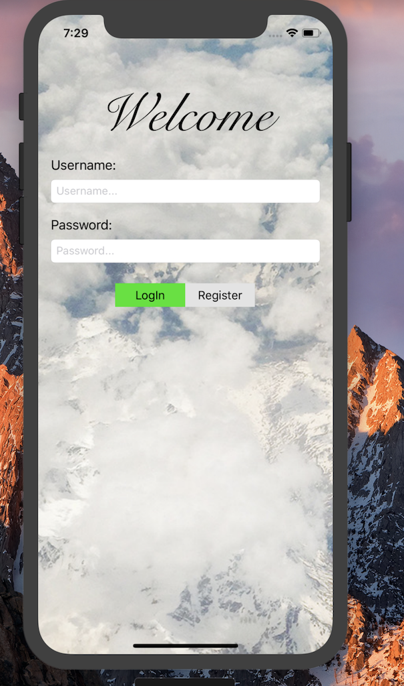
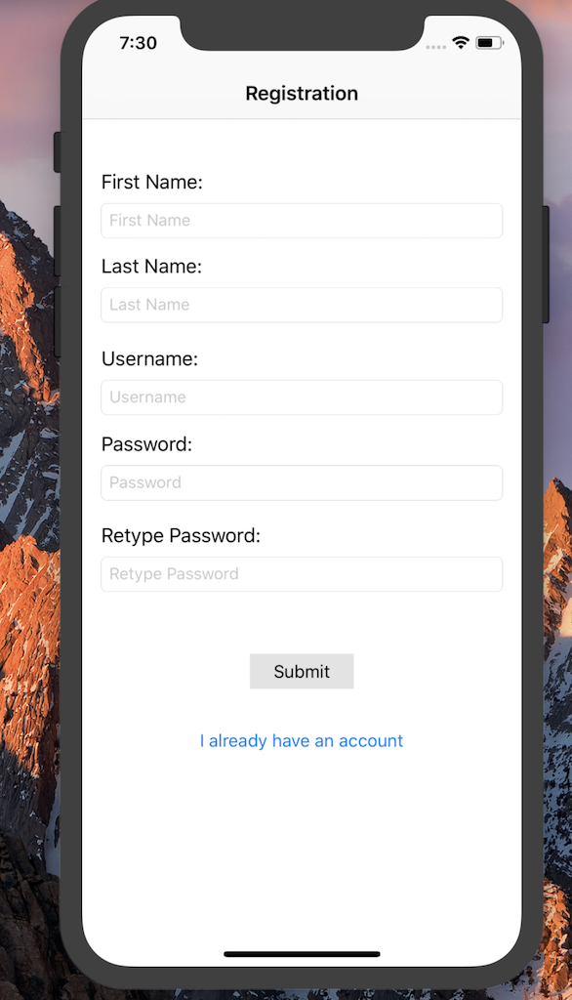
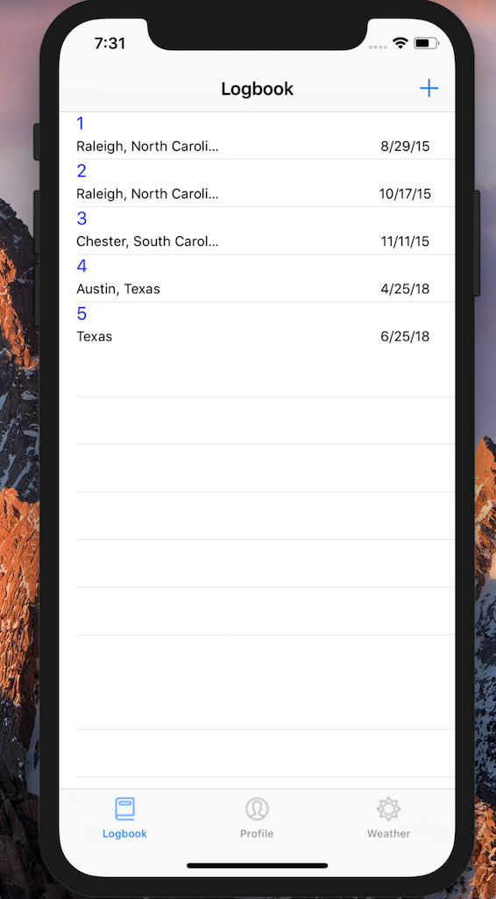
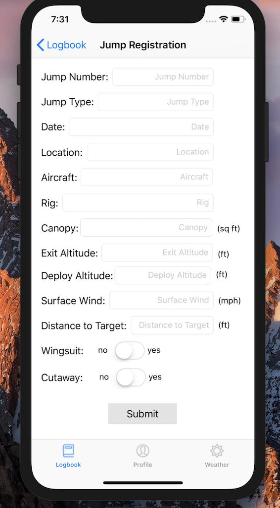
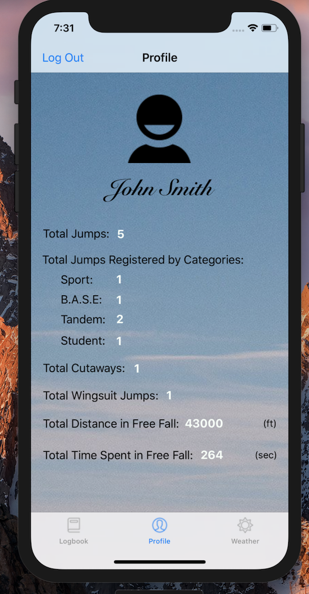
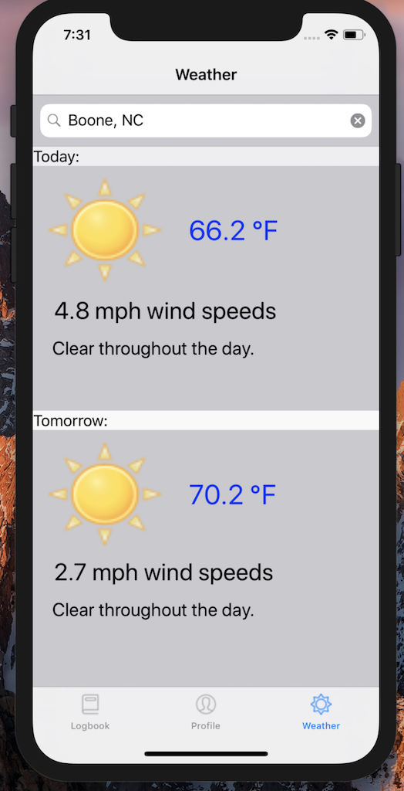

## SkydiveBook – Capstone Project
A prototype of an iOS app to log skydives. A simpler approach to the current pen and paper technique.

*Created for CS 4800 – Capstone Spring 2018

*Author:* Guillaume Gutkin Nicolas

---

**Project Description**  

-The idea behind this project is to replace the current physical logbooks handed out at skydiving dropzones, making it one less thing to worry about packing. The app consists of a user registraion/login page and three tab features. The features include A logbook that keeps an organized list of the users jumps, a profile which displays a summary of the jumpers accomplishments, and a weather app that allows users to check the weather at their local spot before driving over. The hope is too have as many skydivers download and start using this app. 

-The technology used to make this project is listed bellow:
        -Developed on a MacBook
        -Xcode as the editor
        -Programming Languages: Swift, PHP, mySQL
        -MAMP as the local server
        -darksky API for the weather data

---

**Screenshots**

---

**User instructions**

-To run the project the files must be uploaded to Xcode or a similar IDE and ran through the simulator. Then a version of MAMP must be installed on the local machine. Lastly the SQL file contains the code to plug into the database to create the tables. Once those steps are followed the app will work.

---

**Developer instructions**

-The Development environment that I used was Xcode. To test out the app the code files can be transfered to a local set up of Xcode and ran using the simulator. 

-To run tests users can interact with the app through the simulator. If the app is not loading the right information then i recommend using the curl terminal command. 

-To contribute to this project please contact me at (ggn@gmail.com) 

---
**Resources**

    

			 
